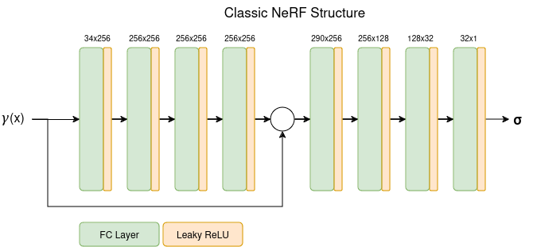
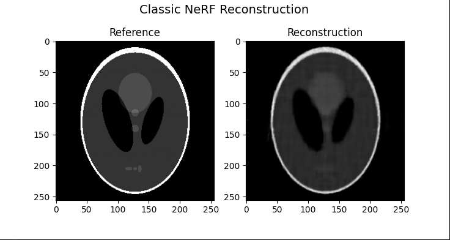

# NeRF-Based CT Reconstruction 

Following my previous experience on 3D reconstruction, I was interested in trying neural methods for representing a density field, 
such that the scene could be encoded by the model. Now that NeRF models have become insanely popular, it seemed like a good time to 
work on a proof-of-concept for this idea.

## Overview
The structure of the model is verly similar to NeRF, however I chose to go with fewer hidden layers as there is less information to be represented.
For CT scanning, we are only interested in the density at a given point. There is no color information and the density does not change based on the viewing direction.

Also, when working with data from X-Ray sensors, the value represents the integral of density along the ray through the volume (of course after some processing steps which are not necessary with the setup I am using for this). This is also less complex than the volumetric rendering typically used in NeRFs. For each ray, we can sample the model at a given set of points and integrate the values knowing the densities and the distance between samples. When the sinogram is complete, the error is computed as the L2 distance between the original sinogram and the sinogram from the current iteration. 

Finally, when the model is fitted, we want to extract the densities inside the model. This is different from NeRF, where you usually generate a rendering from a novel camera position. In this case, we want to perform a structured sampling of the model at the desired resolution to view the distribution of densities inside the sample. Because it is a continous model, we can theoretically obtain any resolution we want by sampling coarser or finer, but of course the quality of the information will depend a lot on the number of initial projections, their positioning and the quality of the fit.

## Implementation
Since I do not have an X-Ray scanning setup at home, I chose to simulate the data using the `astra-toolbox` library in Python. It allows me to generate a sample image for scanning, generate the scanner geometry and the rotations for the projections. From that data, I generate all the detector positions for each projection, compute the rays, ray-volume intersections and the distribution of sampling points inside the volume. 

Then, the points are evaluated through the model, integrated per ray and we compute the difference between the sinograms. The model is implemented in PyTorch, so everything else is taken care of.

When training is done, we generate another set of sampling points arranged in a grid, and the densities at those points can be assembled into an image which can then be compared to the initial phantom used for testing.

### Traditional NeRF model

For the first approach to this problem, I chose to test a traditional NeRF structure. The actual model is an 8-layer fully connected network which takes in a positional encoding of the specific point we want to query and outputs a density value. The input point values ar passed through a simple 8 degree encoding:

$\gamma(\textbf{x}) = (sin(2^0\pi \textbf{x}), cos(2^0\pi \textbf{x}),\cdots,sin(2^{L-1}\pi \textbf{x}), cos(2^{L-1}\pi \textbf{x}))$ , where $L$ is the encoding degree.

This improves representation of high frequency features, for example the transition between densities.

For this secific experiment I used 128 samples per ray with a $0.45\Delta t$ jitter to introduce some randomness. The result below is obtained with 36 projections, 256 pixels per projection and 2000 training iterations. The image resolution is 256x256.

The next step is to implement a model leveraging neural hash grids to hopefully improve accuracy in local features.