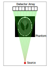
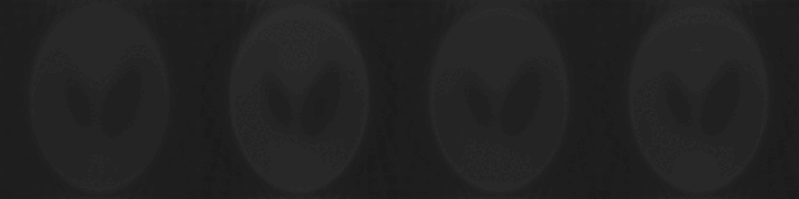
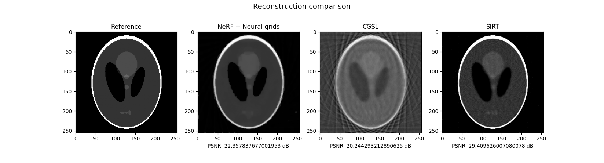

# NeRF-Based CT Reconstruction 

Following my previous experience on 3D reconstruction, I was interested in trying neural methods for representing a density field, 
such that the scene could be encoded by the model. Now that NeRF models have become insanely popular, it seemed like a good time to 
work on a proof-of-concept for this idea.

## Overview
The structure of the model is verly similar to NeRF, however I chose to go with fewer hidden layers as there is less information to be represented.
For CT scanning, we are only interested in the density at a given point. There is no color information and the density does not change based on the viewing direction.

Also, when working with data from X-ray sensors, the value represents the integral of density along the ray through the volume (of course after some processing steps which are not necessary with the setup I am using for this). This is also less complex than the volumetric rendering typically used in NeRFs. For each ray, we can sample the model at a given set of points and integrate the values knowing the densities and the distance between samples. When the sinogram is complete, the error is computed as the L2 distance between the original sinogram and the sinogram from the current iteration. 

Finally, when the model is fitted, we want to extract the densities inside the model. This is different from NeRF, where you usually generate a rendering from a novel camera position. In this case, we want to perform a structured sampling of the model at the desired resolution to view the distribution of densities inside the sample. Because it is a continuous model, we can theoretically obtain any resolution we want by sampling coarser or finer, but of course, the quality of the information will depend a lot on the number of initial projections, their positioning, and the quality of the fit.

## Implementation
Since I do not have an X-Ray scanning setup at home, I chose to simulate the data using the `astra-toolbox` library in Python. It allows me to generate a sample image for scanning, generate the scanner geometry and the rotations for the projections. From that data, I generate all the detector positions for each projection, compute the rays, ray-volume intersections and the distribution of sampling points inside the volume. 

Then, the points are evaluated through the model, integrated per ray and we compute the difference between the sinograms. The model is implemented in PyTorch, so everything else is taken care of.

When training is done, we generate another set of sampling points arranged in a grid, and the densities at those points can be assembled into an image which can then be compared to the initial phantom used for testing.

### Traditional NeRF model

For the first approach to this problem, I chose to test a traditional NeRF structure. The actual model is an 8-layer fully connected network that takes in a positional encoding of the specific point we want to query and outputs a density value. The input point values are passed through a simple 8-degree encoding:

$\gamma(\textbf{x}) = (sin(2^0\pi \textbf{x}), cos(2^0\pi \textbf{x}),\cdots,sin(2^{L-1}\pi \textbf{x}), cos(2^{L-1}\pi \textbf{x}))$ , where $L$ is the encoding degree.

This improves the representation of high-frequency features, for example, the transition between densities.

For this specific experiment, I used 128 samples per ray with a $0.45\Delta t$ jitter to introduce some randomness. The result below is obtained with 36 projections, 256 pixels per projection and 2000 training iterations. The image resolution is 256x256.

The next step is to implement a model leveraging neural hash grids to hopefully improve accuracy in local features.

### Neural Hash Grids
Building on the initial model, I wanted to explore a more advanced approach to density field representation using neural hash grids instead of simple frequency positional encodings. This allows the NeRF model to be smaller and introduces another set of learnable embeddings associated with a set of multiresolution grids spanning the reconstructed space. This idea references the NVIDIA paper [Instant Neural Graphics Primitives with a Multiresolution Hash Encoding](https://arxiv.org/abs/2201.05989). Even though in their implementation they use the **tiny-cuda-nn** approach for very fast training and inference of folly fused MLP networks, I implemented the model in Python following the indication and the approach presented in their paper.

The main idea of this approach is to associate to each grid level a set of trainable feature vectors, where each vertex of the grid corresponds to an entry in the set. Given a query point, we can interpolate the features corresponding to each corner of the cell the point resides in at a certain grid level. This is done at all levels and the interpolated features are concatenated and passed as input to the NeRF model. This means that for a certain query point, during backpropagation, only 4 entries in each feature vector set need to be updated, which speeds up training and inference, since not all parameters of the model need to be updated. 

Of course, we can only have a limited number of feature vectors for each grid level, which means that at a higher resolution, there are more grid vertices than entries in the feature vector set. This introduces the need for a spatial hashing function, which takes the coordinates of a grid vertex and outputs the index of an entry in the feature vector set. In the original implementation, the resolutions are quite high, so the need for a good hashing method is important. However, for my work here, the resolutions are small and the number of vertices does not greatly exceed the set size. Still, I implemented the hashing to maintain future compatibility.

### Noise filtering
Usually, NeRF applications have the purpose of overfitting a model given some initial images and camera poses in order to generate renders from novel locations. However, for CT reconstructions the purpose is not simulating a scan from a novel detector position, but evaluating the attenuation field learned by the model. This means that overfitting from a limited number of projections leads to some artifacts which are beneficial in terms of reducing the loss function, but unwanted when it comes to the model performance for a reconstruction task. To remove some of the high-frequency noise, I used Total Variation regularization. This comes in the form of an additional term in the loss function. The complete loss function is then expressed as $\mathcal{L} = \mathcal{L}_{MSE} + \lambda ║\nabla f║ $, where $\nabla f$ is the gradient of the estimated attenuation field. The first term ensures the data fidelity with respect to the input sinogram, while the second term aims to reduce the noise. The TV loss has to be weighted by a term $\lambda$, which describes the strength of the denoiser. The illustration below shows the evolution of the model with 2000 iterations using $\lambda$ values: 0.0, 0.0025, 0.005, 0.01, from left to right respectively.

## Results
I will quickly present the results from the final model, the one implementing neural hash grids and TV regularization. All reconstruction methods were allowed to run for 2000 iterations, on the GPU (NVIDIA RTX 3050 Ti Mobile). The sinograms were generated from a 256x256 image of the Shepp-Logan phantom, which is also the resolution for all reconstructions. The other algorithms evaluated are SIRT and CGLS, which are both iterative algebraic methods. The figure below shows the results from each method. I used the `astra-toolbox` library to generate the data and perform the algebraic reconstruction.

The results are as follows:
|      | PSNR (dB) | Time (s) |
|:----:|:---------:|:--------:|
| SIRT |  **29.4** | **1.38** |
| CGLS |   20.24   |   1.39   |
| NeRF |   22.35   |  271.42  |

It seems that for this task, where the reconstruction space is quite small and there is no noise in the data, algebraic methods have better quality and perform orders of magnitude faster than my (probably not great) NeRF implementation. Probably using tiny-cuda-nn instead of a naive Python implementation would significantly reduce training time, but there would still be quite a performance gap to cover. Still, this was a fun and interesting project to work on and to try to apply new research from the field of computer vision and graphics to an imaging problem that has existed for far longer and on which I have worked before.
